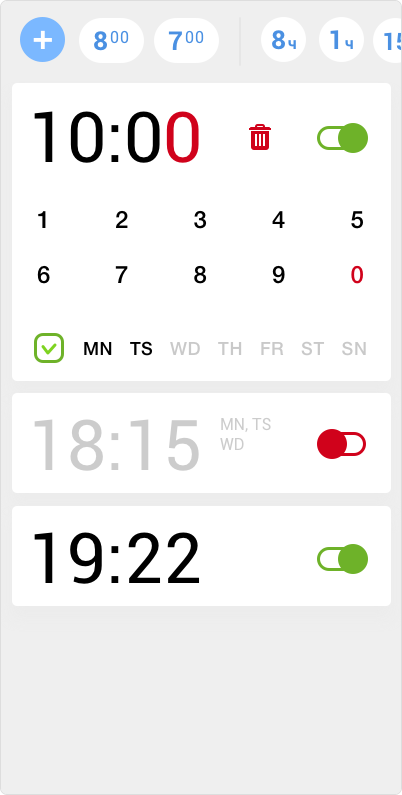

## Будильник ##

В качестве приложения для реализации был выбран будильник, который я довольно давно нарисовал, но сделать его так и не получалось. Вышел удобный случай. 

Скачать для Android: [.apk](https://github.com/gcor/shri/raw/alarm/alarm.apk)

###Макет###
В сторе  я не нашел будильников, в которых время сигнала вводится цифрами. Мне захотелось восполнить этот проблел. Правда такой подход показал ряд недостатков. Сверху разположена панель с быстрым добавлением будильника. Можно поставить сигнал, как на утро, так и на часик подремать.



###Сборка###
Исходники проекта лежат в src и компилируются с помощью gulp в папку www  
Команда `gulp w` вначале собирает приложение:
```
phonegap build browser
phonegap serve browser
```
После этого gulp, как обычно, следит за изменениями в проекте. 

###Плагины###
Для работы будильника используются два плагина для:
* сохранения сигналов в базу через [cordova-plugin-indexedDB](https://github.com/Microsoft/cordova-plugin-indexedDB)
* показ нотификаций через [cordova-plugin-local-notifications](https://github.com/katzer/cordova-plugin-local-notifications)
 
###Ньюансы###
Я просмотрел каждый из фреймворков, установил и потестировал продукты ionic, попробовал стандарнтные проекты из `phonegap template list`, в том числе framework7. Но в итоге приложение решил сделать на чистом js, потому что дизайн предполагался свой, а подключать большой фреймворк ради тач событий я посчитал излишним.

Основные трубности возникли с sdk, но в этом помог [build.phonegap.com](https://build.phonegap.com), который умеет собирать проекты в облаке, сообщая о возникших ошибках.

Как indexedDB, так и плагин для нотификаций работали сразу, единственное не получилось сделать звуковой сигнал оповещения.
